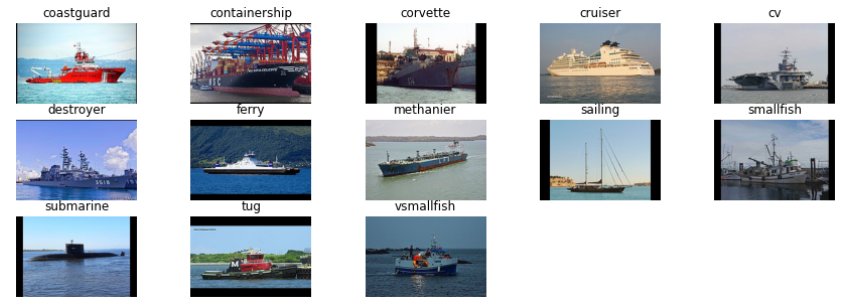
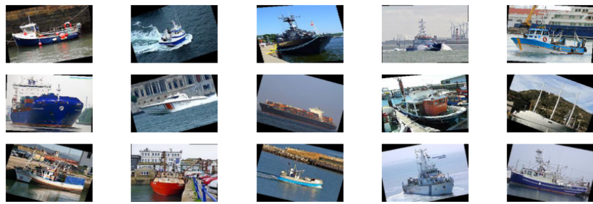
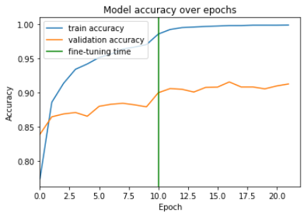
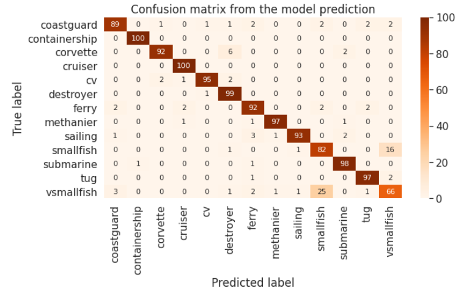

# Transfer learning for ship classification

Transfer learning with a convolutional neural network for ship classification. All the explanations and details of the dataset and the convolutional neural network can be found in the jupyter notebook ``main.ipynb``.

The kaggle version of this notebook can be found <a href="https://www.kaggle.com/ilanguenet/iren-competition-2-louis-guo-and-ilan-guenet">here</a>.

The goal is to predict the type of a ship along 13 different categories of ships.

## Table of content
* Check data
* Setup data
* Data augmentation
* Model
* Model training
* Model accuracy
* Submission
* More images

## Dataset

The dataset can be found on kaggle <a href="https://www.kaggle.com/c/shipsmano2021">here</a>.

Here are some images from the dataset used to train the neural network.



Here are some images from the submission dataset. Submission images are slightly rotated.



## Transfer learning with a convolutional neural network

In this notebook, we are going to use a pre-trained convolutional neural network (CNN) model and add on the top of it some custom layers. The transfer of learning comes from the pre-trained CNN model.

### Resnet50

```python
from keras.applications import ResNet50

model_resnet50 = ResNet50(include_top=False,
                          weights="imagenet",
                          input_shape=input_shape,
                          pooling='max')
```

Number of layers:  176

### Custom Model

Number of layers:  2

Model: "custom_model"

| Layer (type) | Output Shape | Param #  |
| ------------- |:-------------:| -----:|
| custom_bn (BatchNormalization) | (None, 2048) | 8192|
| dense (Dense) | (None, 13) | 26637|

* Total params: 34,829
* Trainable params: 30,733
* Non-trainable params: 4,096

### Merge models

Number of layers:  178
Model: "sequential"

| Layer (type) | Output Shape | Param #  |
| ------------- |:-------------:| -----:|
| resnet50 (Functional) | (None, 2048) | 23587712 |
| custom_model (Sequential) | (None, 13) | 34829 |

* Total params: 23,622,541
* Trainable params: 23,565,325
* Non-trainable params: 57,216

## Training

There are two training steps. The **first step** is to only train the layers in the custom on the top model. The ResNet50 layers are frozen. Then, a second training is performed. This time, the whole model (the ResNet50 model and the custom model) is trainable. During this second step, the learning is very low because it is a step of **fine tuning**.

The training is performed with with checkpoints and early stopping if needed.

### First train

Here is the verbose of the last epoch:

```
Epoch 00009: val_accuracy did not improve from 0.88433
Epoch 10/10
670/670 [==============================] - 314s 469ms/step - loss: 0.0773 - accuracy: 0.9729 - val_loss: 0.4091 - val_accuracy: 0.8791
```

### Fine tuning

Here is the verbose of the last epoch:

```
Epoch 00011: val_accuracy did not improve from 0.91546
Epoch 12/20
670/670 [==============================] - 317s 474ms/step - loss: 0.0057 - accuracy: 0.9987 - val_loss: 0.3788 - val_accuracy: 0.9125
```

### Training curve

Here is the curve of the model accuracy (with training accuracy and validation accuracy):



## Result

The model accuracy over the test data is **92.31%**.

And the confusion matrix is the following:


